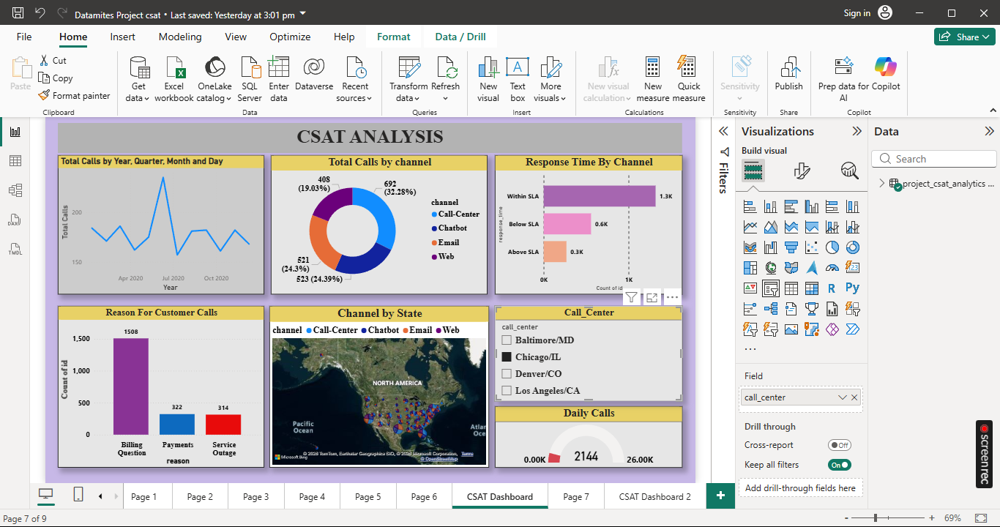
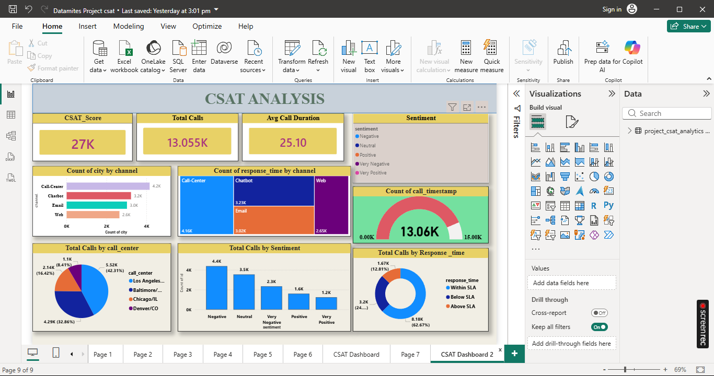

# CSAT Analytics Dashboard

## Project Overview

The CSAT Analytics Dashboard is an interactive Power BI solution developed to analyze customer satisfaction performance and provide actionable business insights through data visualization and KPI monitoring.

## Business Problem

Customer satisfaction is a critical performance indicator for any organization. Businesses require a centralized dashboard to monitor customer feedback, track service quality, identify performance trends, and support data-driven decision-making.

## Objectives

- Monitor Customer Satisfaction (CSAT) performance.
- Analyze customer interaction trends.
- Track operational KPIs.
- Identify improvement opportunities.
- Support strategic business decisions.

## Tools & Technologies

- Power BI
- DAX
- Power Query
- Data Modeling
- Data Visualization
- Microsoft Excel

## Dashboard Features

- Customer Satisfaction Analysis
- Channel-wise Performance Analysis
- Call Volume Monitoring
- Response Time Analysis
- Geographic Analysis
- Interactive Filters and Drill-Through Reports
- KPI Tracking Dashboard

## Project Files

- CSAT_Analytics_Dashboard.pbix
- CSAT Analytics PPT.pptx
- CSAT_Insights.docx
- Dashboard_1.png
- Dashboard_2.png

## Dashboard Preview

### Dashboard 1

### Dashboard 2

## Key Insights

- Evaluated customer satisfaction performance across multiple service channels.
- Identified customer interaction patterns and trends.
- Monitored operational KPIs through interactive dashboards.
- Analyzed response times and service efficiency.
- Supported business decision-making through data-driven insights.

## Business Impact

This dashboard enables stakeholders to monitor customer satisfaction metrics, identify performance gaps, improve service quality, and enhance overall customer experience through actionable insights.

## Skills Demonstrated

- Data Cleaning
- Data Transformation
- Data Modeling
- DAX Calculations
- KPI Development
- Dashboard Design
- Business Intelligence
- Data Visualization
